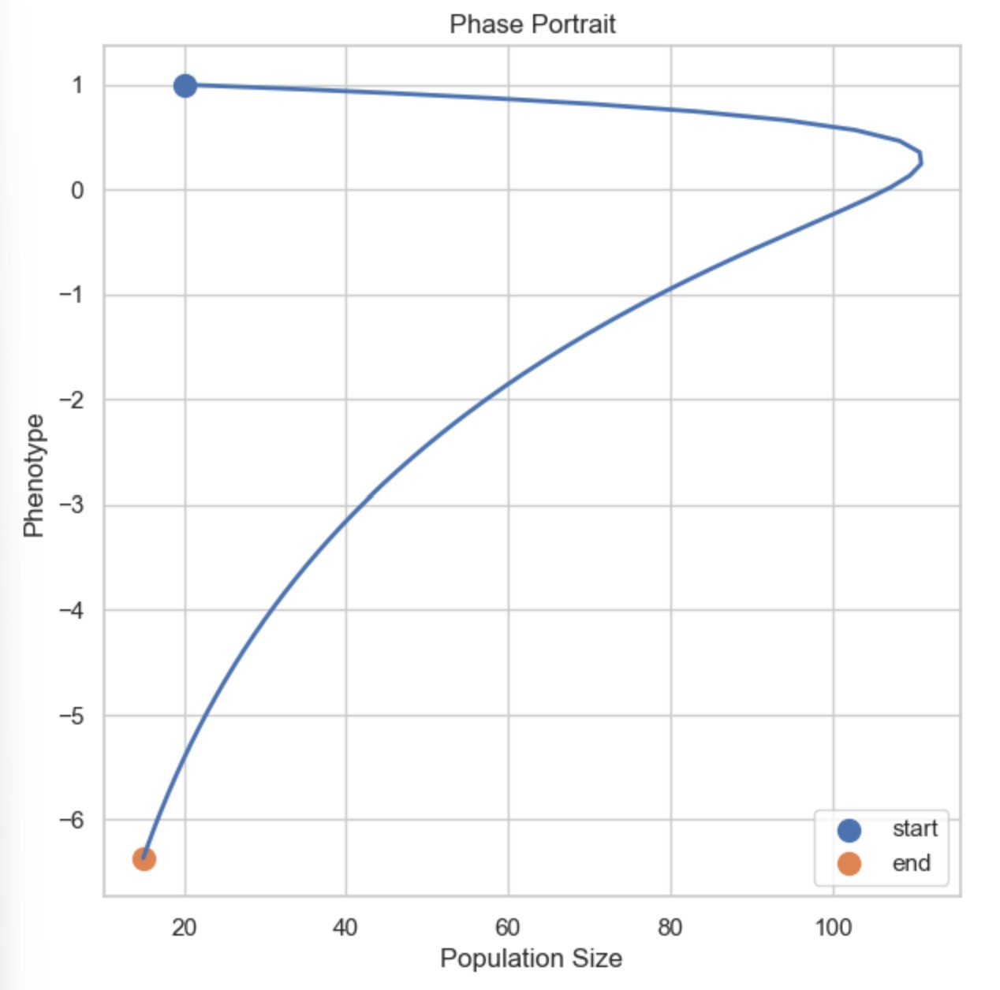
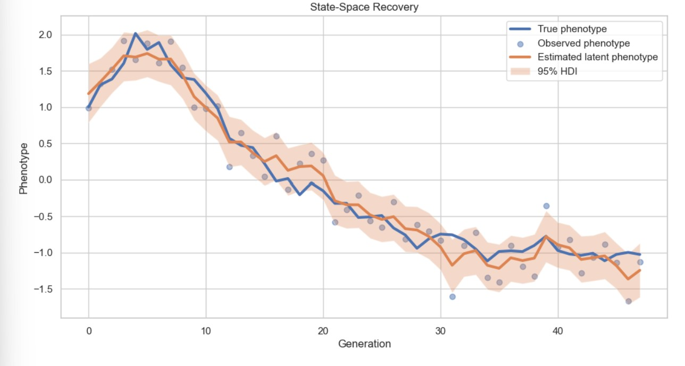
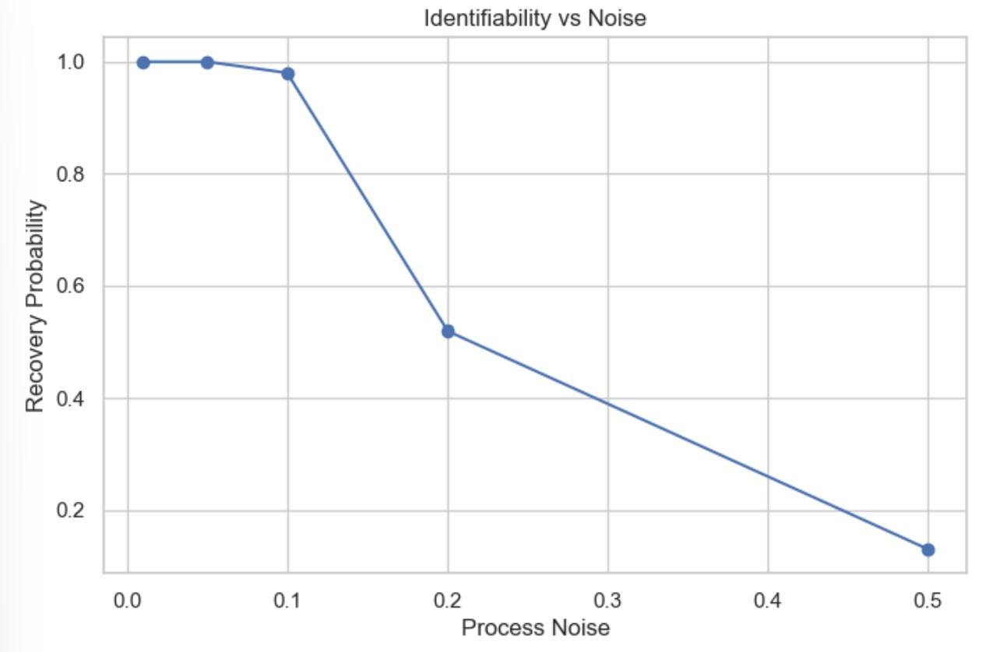
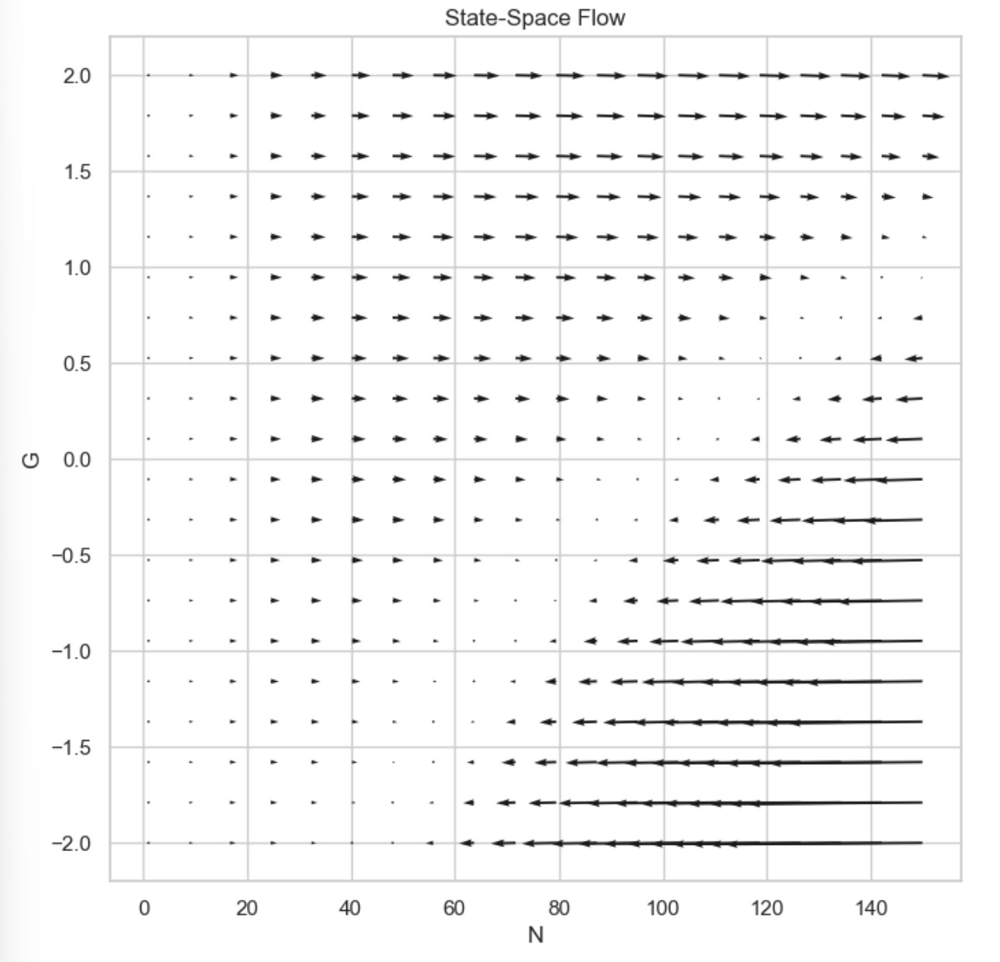

# State-Space Eco-Evolutionary Feedback Model (Prototype)

This repository contains a lightweight exploratory implementation of eco-evolutionary feedback models using synthetic time series of population abundance and phenotypic traits.

The goal is to test how eco-evolutionary coupling can be represented in a state-space framework, and what kinds of dynamics emerge under different feedback assumptions.

This project is a rapid prototype developed to explore ideas inspired by eco-evolutionary modeling and to assess feasibility for Bayesian inference extensions.

---

# 1. Biological motivation

We study coupled dynamics between:

- population abundance: $N(t)$  
- mean phenotype: $z(t)$  

The central question is how ecological dynamics (population size) and evolutionary dynamics (trait evolution) mutually influence each other.

---

# 2. Model structure

## 2.1 Ecological dynamics (no evolution)

$$
N_{t+1} = N_t + r N_t \left(1 - \frac{N_t}{K}\right)
$$

where:
- $r$ is intrinsic growth rate
- $K$ is carrying capacity

---

## 2.2 Phenotypic dynamics (neutral evolution / drift)

$$
z_{t+1} = z_t + \epsilon_t
$$

where $\epsilon_t$ is stochastic variation (genetic drift / environmental noise)

---

## 2.3 Eco-evolutionary feedback model

The coupled system is defined as:

### Ecology depends on phenotype:

$$
N_{t+1} = f(N_t, z_t)
$$

Example implementation:

$$
r(z_t) = r_0 + G z_t
$$

$$
N_{t+1} = N_t + r(z_t) N_t \left(1 - \frac{N_t}{K}\right)
$$

---

### Evolution depends on ecology:

$$
z_{t+1} = z_t + \beta N_t + \eta_t
$$

where:
- $\beta$ represents eco → evo feedback
- $\eta_t$ is stochastic variation

---

# 3. Model hierarchy explored

The notebook implements progressively complex models:

1. Pure ecological model (logistic growth)
2. Neutral phenotypic drift
3. One-way coupling (eco → evo or evo → eco)
4. Full feedback loop (eco-evo feedback)
5. State-space representation with observation noise

---

# 4. State-space formulation

Hidden states:

- $N_t$, $z_t$

Observed variables:

$$
N^{obs}_t = N_t + \epsilon_t
$$

$$
z^{obs}_t = z_t + \eta_t
$$

---

# 5. Key results (qualitative)

- Feedback introduces oscillatory and non-linear dynamics
- Similar time series can emerge from different parameter sets (identifiability issue)
- Noise strongly affects inference of coupling strength
- Directionality of feedback is not easily recoverable from observation alone

---

# 6. Limitations

- No full Bayesian inference implemented yet
- No particle filtering / Kalman filtering
- Synthetic data only (no empirical calibration)
- Limited identifiability analysis
- Simplified phenotype structure (scalar trait only)

---

# 7. Future work

- Bayesian inference of eco-evolutionary parameters
- Particle filtering / state-space estimation
- Application to real ecological time series
- Multi-trait and multivariate extensions
- Model selection between competing eco-evo hypotheses

---

# 8. Bayesian inference meta code

def process_model(state_t, θ):  
    N_t, z_t = state_t  
  
    N_next = N_t + r*N_t*(1 - N_t/K) + G*z_t  
    z_next = z_t + β*N_t + evo_noise  
  
    return N_next, z_next  
  
def observation_model(state_t):  
    N, z = state_t  
  
    N_obs = N + normal(0, σ_N)  
    z_obs = z + normal(0, σ_z)  
   
    return N_obs, z_obs  
  
θ ~ Prior distribution  
  
r ~ Normal(1.0, 0.5)  
K ~ LogNormal(...)  
G ~ Normal(0, 1)  
β ~ Normal(0, 1)  
σ ~ HalfNormal(...)  
  
for i in range(N_particles):  
    θ_i ~ prior   
    state_i[0] ~ init_distribution  
  
--- MCMC ---  
  
for iteration in range(T):  
  
    θ_proposal = propose(θ_current)  
  
    # simulate model  
    simulated_data = simulate(process_model, θ_proposal)  
  
    # compute likelihood  
    L_new = likelihood(simulated_data, observed_data)  
    L_old = likelihood(current_simulation, observed_data)  
  
    acceptance_ratio = (L_new * prior(θ_new)) / (L_old * prior(θ_old))  
  
    if random() < acceptance_ratio:  
        θ_current = θ_proposal  
  
--- Particle filter ---    
  
initialize particles:  
    for i:  
        state_i ~ prior  
        weight_i = 1/N  
  
for t in time_series:  
  
    # 1. propagate  
    for particle i:  
        state_i = process_model(state_i, θ) + noise  
  
    # 2. compute weights  
    for particle i:  
        weight_i = likelihood(observation_t | state_i)  
  
    # 3. normalize  
    weights = normalize(weights)  
   
    # 4. resample  
    particles = resample(particles, weights)  
  
